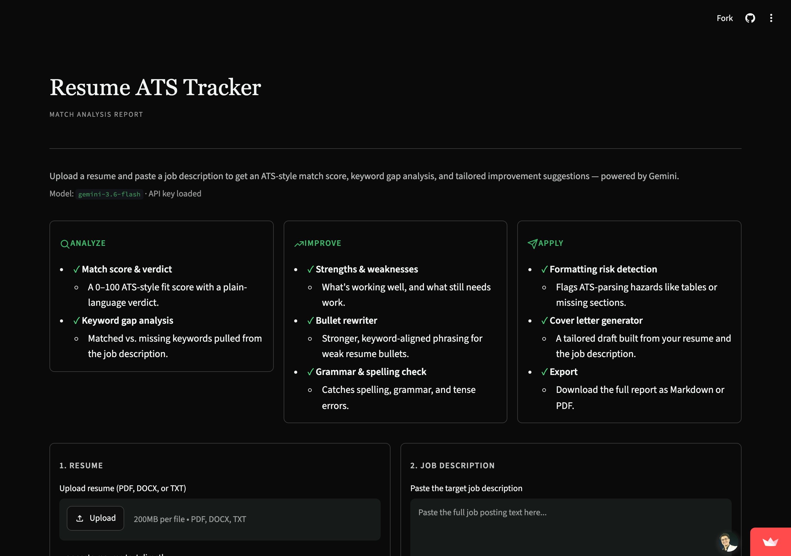
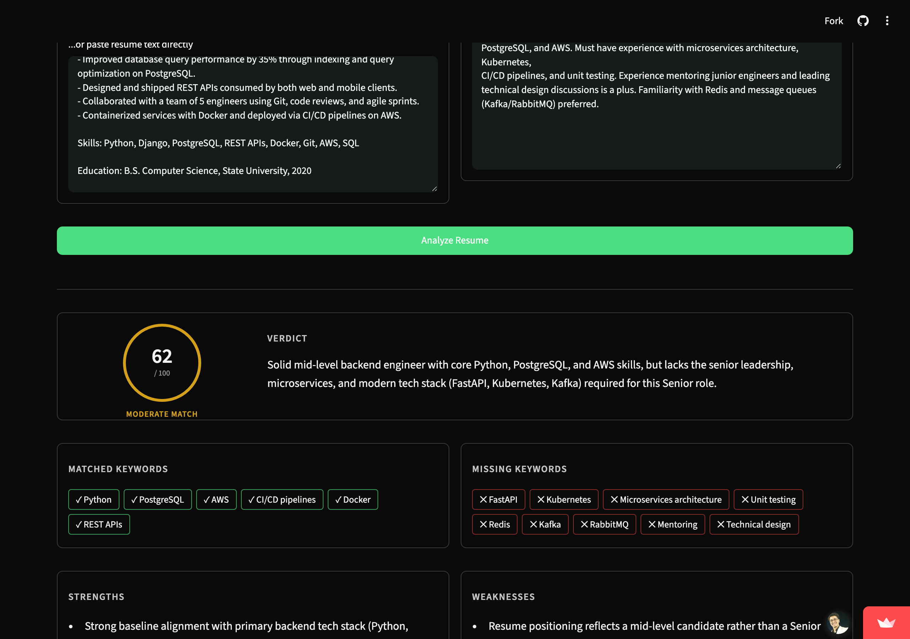
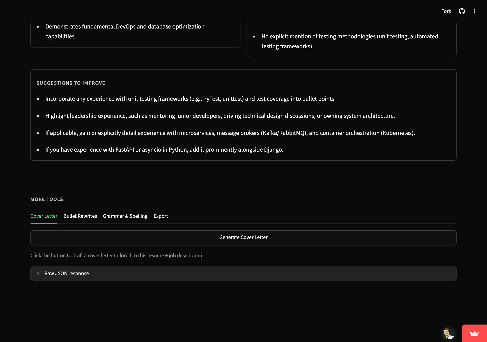

# 📄 Resume ATS Tracker

A Streamlit app that scores a resume against a job description using the Google Gemini API —
get an ATS-style match score, a keyword gap analysis, a tailored cover letter, and AI-rewritten
resume bullets, all in one place.


**Live app:** [track-resume-ats.streamlit.app](https://track-resume-ats.streamlit.app)

---

## ✨ Features

| | |
|---|---|
| 🎯 **Match Score** | 0–100 ATS-style score with a one-line verdict on overall fit |
| 🔑 **Keyword Gap Analysis** | Matched vs. missing keywords pulled straight from the job description |
| 💪 **Strengths & Weaknesses** | Plain-language breakdown of what's working and what's not |
| 🛠️ **Actionable Suggestions** | Concrete edits to improve the resume for the target role |
| 📐 **ATS Formatting Risks** | Flags parsing hazards like tables, columns, or missing sections |
| ✍️ **Cover Letter Generator** | One click drafts a tailored cover letter from the resume + JD |
| 🔁 **Bullet Rewriter** | Rewrites the weakest resume bullets with stronger, keyword-aligned phrasing |
| ✅ **Grammar & Spelling Check** | Flags spelling, grammar, and tense errors, with corrected snippets |
| ⬇️ **Export** | Download the full report as Markdown or PDF |

The homepage itself also lays out the toolkit at a glance, grouped into three stages —
**Analyze**, **Improve**, and **Apply** — before you upload anything.

## 📸 Screenshots

**Homepage** — features overview before you upload anything



**Analysis results** — match score, verdict, and matched/missing keywords



**Suggestions + More Tools** — actionable edits, plus cover letter, bullet rewriter, grammar check, and export



## 🚀 Quick Start

**1. Install dependencies**

```bash
pip install -r requirements.txt
```

**2. Add your Gemini API key**

Get one from [Google AI Studio](https://aistudio.google.com/apikey), then edit the `.env` file
in the project root:

```bash
GEMINI_API_KEY=your-api-key-here
GEMINI_MODEL=gemini-3.6-flash
```

**3. Run the app**

```bash
streamlit run app.py
```

**4. Use it** — upload or paste a resume, paste a job description, and click **Analyze Resume**.

## 🗂️ Project Structure

```
Resume-ATS-Tracking/
├── app.py                    # Streamlit UI + Gemini calls + result rendering
├── resume_parser.py          # PDF / DOCX / TXT text extraction for uploaded resumes
├── requirements.txt          # Python dependencies
├── .streamlit/config.toml    # App theme (black background, light green accent)
├── LICENSE                   # MIT license
└── .env                      # Gemini API key & model config (not committed)
```

## 🧰 Tech Stack

- [Streamlit](https://streamlit.io/) — UI
- [Google Gemini API](https://ai.google.dev/) — resume/JD analysis, cover letters, bullet rewrites, grammar check
- `pdfplumber` / `python-docx` — resume text extraction
- `fpdf2` — PDF report export

## 📄 License

[MIT](LICENSE)
