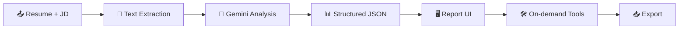

<div align="center">

# 📄 Resume ATS Tracker

A Streamlit app that scores a resume against a job description using the Google Gemini API —
get an ATS-style match score, a keyword gap analysis, a tailored cover letter, and AI-rewritten
resume bullets, all in one place.


🔗 **[Try it live](https://track-resume-ats.streamlit.app)**

</div>

---

## ✨ Features

| | |
|---|---|
| 🎯 **Match Score** | 0–100 ATS-style score with a one-line verdict on overall fit |
| 🔑 **Keyword Gap Analysis** | Matched vs. missing keywords pulled straight from the job description |
| 💪 **Strengths & Weaknesses** | Plain-language breakdown of what's working and what's not |
| 🛠️ **Actionable Suggestions** | Concrete edits to improve the resume for the target role |
| 📐 **ATS Formatting Risks** | Flags parsing hazards like tables, columns, or missing sections |
| ✍️ **Cover Letter Generator** | One click drafts a tailored cover letter from the resume + JD |
| 🔁 **Bullet Rewriter** | Rewrites the weakest resume bullets with stronger, keyword-aligned phrasing |
| ✅ **Grammar & Spelling Check** | Flags spelling, grammar, and tense errors, with corrected snippets |
| ⬇️ **Export** | Download the full report as Markdown or PDF |

---

## ⚙️ How It Works



| | Step | What happens |
|---|---|---|
| 📤 | **Input** | Upload a PDF/DOCX/TXT resume or paste it directly, then paste the target job description. |
| 🔎 | **Extraction** | `resume_parser.py` pulls plain text out of the file — including table cells, since resumes often use tables for layout. |
| 🤖 | **Gemini analysis** | The resume + JD are sent to Gemini with a prompt that forces a strict JSON response (`response_mime_type="application/json"`). |
| 📊 | **Structured JSON** | Match score, verdict, matched/missing keywords, strengths, weaknesses, suggestions, and formatting risks — parsed defensively, never assumed clean. |
| 🖥️ | **Report UI** | The JSON drives the score ring's color/tier, the green/red keyword tags, and every results card. |
| 🛠️ | **On-demand tools** | The cover letter generator, bullet rewriter, and grammar checker are separate Gemini calls, only triggered on click. |
| 📥 | **Export** | Download everything — report, cover letter, rewrites, grammar fixes — as Markdown or a formatted PDF (`fpdf2`). |

---

## 📸 Screenshots

<p align="center"><b>Homepage</b> — features overview before you upload anything</p>


<p align="center"><b>Analysis results</b> — match score, verdict, and matched/missing keywords</p>


<p align="center"><b>Suggestions + More Tools</b> — actionable edits, plus cover letter, bullet rewriter, grammar check, and export</p>


---

## 🚀 Quick Start

**1. Install dependencies**

```bash
pip install -r requirements.txt
```

**2. Add your Gemini API key**

Get one from [Google AI Studio](https://aistudio.google.com/apikey), then edit the `.env` file
in the project root:

```bash
GEMINI_API_KEY=your-api-key-here
GEMINI_MODEL=gemini-3.6-flash
```

**3. Run the app**

```bash
streamlit run app.py
```

**4. Use it** — upload or paste a resume, paste a job description, and click **Analyze Resume**.

---

## 🧰 Tech Stack

<p align="center">
  
  
  
  
  
</p>

---

<div align="center">

📄 [MIT License](LICENSE)

</div>
